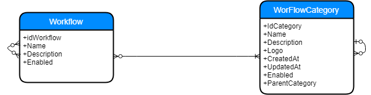

# workflow management project 

This project is an actual implementation of these technical specifications ( see image ) using NodeJs, ExpressJs, Mocha , Mongoose and Mongodb 

Documentation are written with Swagger following OpenAPI standards .



## Run Project
```
npm install
npm start
```
## View Swagger Documentation

```
npm start 
```
[github]localhost:3000/api-docs

## Run Test
```
npm test
```

